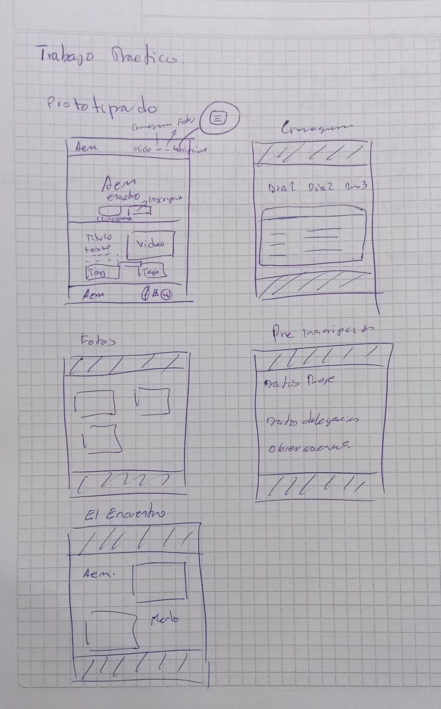

# 🇦🇷 Argentina en Merlo — Sitio Web Oficial


Repositorio oficial del sitio web interactivo para el **Encuentro Nacional de Folklore "Argentina en Merlo"**, celebrado anualmente en la Villa de Merlo, San Luis. 

El proyecto proporciona una plataforma informativa y de pre-inscripción para delegaciones, bailarines y espectadores de todo el país.

---

## 🌐 Sitio Web Publicado
El proyecto se encuentra desplegado y alojado públicamente a través de **GitHub Pages**:
👉 **[Ver Sitio Web en Vivo](https://cristianmlive-tech.github.io/Trabajo-Practico-Icaro-1---Argentina-en-Merlo/)**

---

## 🚀 Características Principales

- **Sección Hero Animada:** Portada de bienvenida responsiva con efectos de entrada fluidos programados en CSS (`@keyframes aparecerDesvanecido`).
- **Diseño Adaptativo (Mobile-First):** Maquetación responsiva construida con la grilla y utilidades de **Bootstrap 5** (`d-flex`, `ratio-16x9`, etc.).
- **Accesibilidad Web (A11y):** Implementación de textos descriptivos y la clase `.visually-hidden` para optimizar la navegación con lectores de pantalla para usuarios no videntes.
- **Navegación e Integración Social:** Pie de página (*Footer*) accesible con enlaces seguros (`target="_blank" rel="noopener noreferrer"`) hacia redes sociales y atajos a la página principal.

---

## 📐 Prototipado y Boceto Inicial

Como parte del proceso de maquetación y diseño de la interfaz, se realizó un boceto previo en papel para definir la distribución de la sección Hero, el menú de navegación y las tablas del cronograma:

<p align="center">
  
</p>
<p align="center">
  <em>Boceto en papel de Argentina en Merlo</em>
</p>


## 📂 Estructura de Archivos del Proyecto

```text
📁 argentina-en-merlo/
├── 📁 Img/                  # Logos, vectores y recursos fotográficos (.png, .jpg)
├── 📁 Paginas/              # Subpáginas HTML interconectadas
│   ├── cronograma.html     # Cronograma del evento
│   └── inscripcion.html    # Formulario de pre-inscripción
│   └── encuentro.html       # Información basica del encuentro
│   └── galeria.html         # Fotografías Varias
├── 📁 CSS/                  # Hoja de estilos personalizada y animaciones
├── index.html               # Página principal (Home / Hero section)
└── README.md                # Documentación del proyecto
```
## 📝 Fracmento del Código

```html
<!-- Pie de Página Accesible con Navegación al Inicio -->
<footer class="bg-dark text-white py-4 mt-auto">
    <div class="container d-flex flex-column flex-md-row justify-content-between align-items-center">
        <!-- Logo con Enlace al Inicio -->
        <div class="mb-3 mb-md-0">
            <a href="../index.html" class="d-inline-block text-decoration-none">
                
            </a>
        </div>
        <!-- Enlaces a Redes Sociales -->
        <div class="redes-sociales d-flex gap-3 fs-4">
            <a href="[https://facebook.com](https://facebook.com)" target="_blank" rel="noopener noreferrer" class="text-white hover-icono" aria-label="Facebook Oficial"><i class="bi bi-facebook"></i></a>
            <a href="[https://instagram.com](https://instagram.com)" target="_blank" rel="noopener noreferrer" class="text-white hover-icono" aria-label="Instagram Oficial"><i class="bi bi-instagram"></i></a>
            <a href="[https://wa.me/549110000000](https://wa.me/549110000000)" target="_blank" rel="noopener noreferrer" class="text-white hover-icono" aria-label="Contacto WhatsApp"><i class="bi bi-whatsapp"></i></a>
        </div>
    </div>
</footer>
```